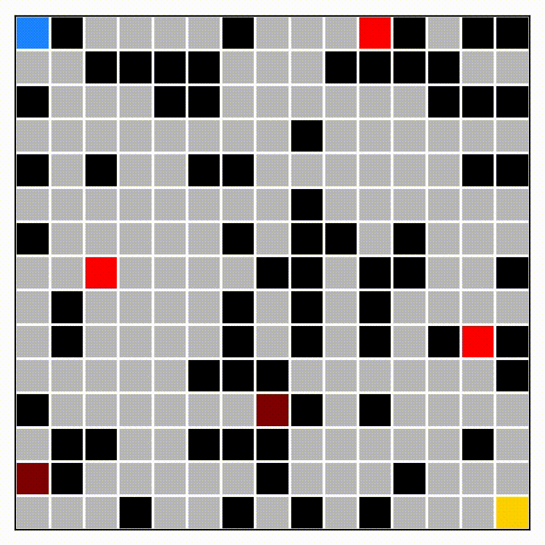

# Ghosts in the Machine
This project is an AI-driven maze solver that operates in a dynamic environment using real time Monte Carlo simulation. 

It consists of 5 agents that use different strategies to solve the maze while avoiding the ghosts in real time. 

## Usage
To run a maze with the visualization, run the following command:
```bash
python3 visualization.py size num ghosts strategy
```
where size is the size of the maze, num ghosts is the number of ghosts, and strategy is the strategy of the agent (1-5).

To run a maze without the visualization, run the following command:
```bash
python3 test.py g_i g_f g_d n max strategy
```
where g_i is the lower bound on the number of ghosts (inclusive), g_f is the upper bound on the number of ghosts (exclusive), g_d is the increment on the number of ghosts, n max is the number of mazes to run per number of ghosts, and strategy is the strategy of the agent (1-5).

## Sample

